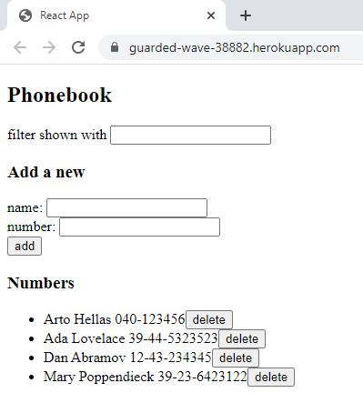

# Part 2: Communicating with server, phonebook

## phonebook

This application allows you to manage a phonebook: addition, modification, deletion and filter of a contact.

This application is deployed using Heroku, a platform as a service (PaaS) that enables developers to build, run, and operate applications entirely in the cloud. 

This backend server in Node returns persons using the Express library which provides an interface to work with the built-in http module. 

The frontend production build is added in the backend to deploy the whole application.

## Here is the link of the deployed application:
https://guarded-wave-38882.herokuapp.com/
https://guarded-wave-38882.herokuapp.com/api/persons

## This project contains two sections:
### BE
https://github.com/baotranC/fullstackopen2022_part3_BE
### FE
https://github.com/baotranC/fullstackopen2022/tree/main/part3/phonebook_part2_Frontend

## CRUD API (resource oriented architecture). 
These are the possible requests: 
- Fetch all persons/resources: GET http://localhost:3001/api/persons
- Fetch a single persons/resource: GET http://localhost:3001/api/persons/[insert id]
- Delete a persons/resource: DELETE http://localhost:3001/api/persons/[insert id]
- Adding a persons resource: POST http://localhost:3001/api/persons
    Content-Type: application/json
    {
        "content": "Postman is a good tool for testing REST-api",
        "important": true
    }
- Fetch all persons info/resources: GET http://localhost:3001/info

## Others
### Tools to test API
These tools allow to test HTTP requests

#### - Postman 
#### - Visual Studio Code REST client plugin 

## Run 
- `npm start`
Runs the node server 
Open [http://localhost:3001](http://localhost:3001) to view the application.
Open [http://localhost:3001/api/persons](http://localhost:3001/api/persons) to view all the persons on the server using the browser.

- `npm run dev`
Run the application. The server runs in the development mode using Nodemon 
Open [http://localhost:3001](http://localhost:3001) to view the application.
Open [http://localhost:3001/api/persons](http://localhost:3001/api/persons) to view all the persons on the server using the browser.

- `npm run build:ui`
Builds the frontend and copies the production version under the backend repository

- `npm run deploy`
Releases the current backend to Heroku.

- `npm run deploy:full`
Combines these two and contains the necessary git commands to update the backend repository.

- `npm run logs:prod`
Show the Heroku logs.